# Cognit DB Schema

SQL migrations live in [`sql/`](sql) as `<version>_<description>.{up,down}.sql` pairs. Applied versions are tracked in the `migrations` table.

```bash
go run cognit.go migrate up -c config.yml
```

Every table has a UUID `id` primary key. Tables suffixed `_meta` are key/value extensions (`key`, `value jsonb`) of their parent table. All foreign keys use `ON DELETE CASCADE`.

## Identity

### `users`

```sql
CREATE TABLE users (
	id UUID PRIMARY KEY,
	name VARCHAR(60) NOT NULL,
	email VARCHAR(60) NOT NULL UNIQUE,
	pwd_hash VARCHAR(200) NOT NULL,
	provider VARCHAR(20) NOT NULL DEFAULT 'local',
	provider_user_id VARCHAR(255),
	role VARCHAR(20) NOT NULL DEFAULT 'regular',
	is_active BOOLEAN DEFAULT true,
	is_email_verified BOOLEAN DEFAULT false,
	email_verify_token VARCHAR(100) NULL UNIQUE,
	last_login_at TIMESTAMP NULL,
	language VARCHAR(20) NOT NULL DEFAULT 'en',
	theme VARCHAR(20) NOT NULL DEFAULT 'default',
	created_at TIMESTAMP DEFAULT (CURRENT_TIMESTAMP AT TIME ZONE 'UTC'),
	updated_at TIMESTAMP DEFAULT (CURRENT_TIMESTAMP AT TIME ZONE 'UTC')
);
CREATE INDEX idx_users_email ON users(email);
```

### `users_meta`

```sql
CREATE TABLE users_meta (
	id UUID PRIMARY KEY,
	user_id UUID NOT NULL REFERENCES users(id) ON DELETE CASCADE,
	key VARCHAR(60) NOT NULL,
	value JSONB,
	created_at TIMESTAMP DEFAULT (CURRENT_TIMESTAMP AT TIME ZONE 'UTC'),
	updated_at TIMESTAMP DEFAULT (CURRENT_TIMESTAMP AT TIME ZONE 'UTC'),
	UNIQUE (user_id, key)
);
CREATE INDEX idx_users_meta_user_id_key ON users_meta(user_id, key);
```

### `user_sessions`

```sql
CREATE TABLE user_sessions (
	id UUID PRIMARY KEY,
	token VARCHAR(100) NOT NULL UNIQUE,
	user_id UUID NOT NULL REFERENCES users(id) ON DELETE CASCADE,
	ip_address VARCHAR(45),
	user_agent VARCHAR(200),
	expires_at TIMESTAMP NOT NULL,
	created_at TIMESTAMP DEFAULT (CURRENT_TIMESTAMP AT TIME ZONE 'UTC'),
	updated_at TIMESTAMP DEFAULT (CURRENT_TIMESTAMP AT TIME ZONE 'UTC')
);
CREATE INDEX idx_user_sessions_token ON user_sessions(token);
```

### `user_api_keys`

```sql
CREATE TABLE user_api_keys (
	id UUID PRIMARY KEY,
	user_id UUID NOT NULL REFERENCES users(id) ON DELETE CASCADE,
	name VARCHAR(60) NOT NULL,
	token VARCHAR(100) NOT NULL UNIQUE,
	expires_at TIMESTAMP NULL,
	created_at TIMESTAMP DEFAULT (CURRENT_TIMESTAMP AT TIME ZONE 'UTC'),
	updated_at TIMESTAMP DEFAULT (CURRENT_TIMESTAMP AT TIME ZONE 'UTC')
);
CREATE INDEX idx_user_api_keys_token ON user_api_keys(token);
```

### `password_reset_tokens`

```sql
CREATE TABLE password_reset_tokens (
	id UUID PRIMARY KEY,
	user_id UUID NOT NULL REFERENCES users(id) ON DELETE CASCADE,
	token VARCHAR(100) NOT NULL UNIQUE,
	expires_at TIMESTAMP NOT NULL,
	created_at TIMESTAMP DEFAULT (CURRENT_TIMESTAMP AT TIME ZONE 'UTC')
);
CREATE INDEX idx_password_reset_tokens_token ON password_reset_tokens(token);
```

## Workspace

### `workspaces`

```sql
CREATE TABLE workspaces (
	id UUID PRIMARY KEY,
	name VARCHAR(60) NOT NULL,
	handle VARCHAR(100) NOT NULL UNIQUE,
	meta JSONB,
	created_at TIMESTAMP DEFAULT (CURRENT_TIMESTAMP AT TIME ZONE 'UTC'),
	updated_at TIMESTAMP DEFAULT (CURRENT_TIMESTAMP AT TIME ZONE 'UTC')
);
CREATE INDEX idx_workspaces_handle ON workspaces(handle);
```

### `workspaces_meta`

```sql
CREATE TABLE workspaces_meta (
	id UUID PRIMARY KEY,
	workspace_id UUID NOT NULL REFERENCES workspaces(id) ON DELETE CASCADE,
	key VARCHAR(60) NOT NULL,
	value JSONB,
	created_at TIMESTAMP DEFAULT (CURRENT_TIMESTAMP AT TIME ZONE 'UTC'),
	updated_at TIMESTAMP DEFAULT (CURRENT_TIMESTAMP AT TIME ZONE 'UTC'),
	UNIQUE (workspace_id, key)
);
```

### `workspace_users`

```sql
CREATE TABLE workspace_users (
	id UUID PRIMARY KEY,
	workspace_id UUID NOT NULL REFERENCES workspaces(id) ON DELETE CASCADE,
	user_id UUID NOT NULL REFERENCES users(id) ON DELETE CASCADE,
	role VARCHAR(20) NOT NULL DEFAULT 'regular',
	created_at TIMESTAMP DEFAULT (CURRENT_TIMESTAMP AT TIME ZONE 'UTC'),
	updated_at TIMESTAMP DEFAULT (CURRENT_TIMESTAMP AT TIME ZONE 'UTC'),
	UNIQUE (workspace_id, user_id)
);
```

### `user_invites`

```sql
CREATE TABLE user_invites (
	id UUID PRIMARY KEY,
	email VARCHAR(60) NOT NULL,
	role VARCHAR(20) NOT NULL DEFAULT 'regular',
	token VARCHAR(100) NOT NULL UNIQUE,
	status VARCHAR(20) NOT NULL DEFAULT 'pending',
	inviter_user_id UUID NOT NULL REFERENCES users(id) ON DELETE CASCADE,
	workspace_id UUID NOT NULL REFERENCES workspaces(id) ON DELETE CASCADE,
	expires_at TIMESTAMP NOT NULL,
	accepted_at TIMESTAMP NULL,
	created_at TIMESTAMP DEFAULT (CURRENT_TIMESTAMP AT TIME ZONE 'UTC'),
	updated_at TIMESTAMP DEFAULT (CURRENT_TIMESTAMP AT TIME ZONE 'UTC')
);
CREATE INDEX idx_user_invites_token ON user_invites(token);
```

### `access_keys`

```sql
CREATE TABLE access_keys (
	id UUID PRIMARY KEY,
	workspace_id UUID NOT NULL REFERENCES workspaces(id) ON DELETE CASCADE,
	name VARCHAR(60) NOT NULL,
	token VARCHAR(100) NOT NULL UNIQUE,
	expires_at TIMESTAMP NULL,
	meta JSONB,
	created_at TIMESTAMP DEFAULT (CURRENT_TIMESTAMP AT TIME ZONE 'UTC'),
	updated_at TIMESTAMP DEFAULT (CURRENT_TIMESTAMP AT TIME ZONE 'UTC')
);
CREATE INDEX idx_access_keys_workspace_id ON access_keys(workspace_id);
CREATE INDEX idx_access_keys_token ON access_keys(token);
```

### `workspace_kv`

```sql
CREATE TABLE workspace_kv (
	id UUID PRIMARY KEY,
	workspace_id UUID NOT NULL REFERENCES workspaces(id) ON DELETE CASCADE,
	key VARCHAR(200) NOT NULL,
	value TEXT NOT NULL,
	expires_at TIMESTAMP,
	created_at TIMESTAMP DEFAULT (CURRENT_TIMESTAMP AT TIME ZONE 'UTC'),
	updated_at TIMESTAMP DEFAULT (CURRENT_TIMESTAMP AT TIME ZONE 'UTC'),
	UNIQUE (workspace_id, key)
);
CREATE INDEX idx_workspace_kv_expires_at ON workspace_kv(expires_at);
```

## Billing

### `subscriptions`

```sql
CREATE TABLE subscriptions (
	id UUID PRIMARY KEY,
	workspace_id UUID NOT NULL REFERENCES workspaces(id) ON DELETE CASCADE,
	provider_customer_id VARCHAR(200),
	ai_tokens_balance BIGINT NOT NULL DEFAULT 0,
	created_at TIMESTAMP DEFAULT (CURRENT_TIMESTAMP AT TIME ZONE 'UTC'),
	updated_at TIMESTAMP DEFAULT (CURRENT_TIMESTAMP AT TIME ZONE 'UTC'),
	UNIQUE (workspace_id)
);
```

### `subscriptions_meta`

```sql
CREATE TABLE subscriptions_meta (
	id UUID PRIMARY KEY,
	subscription_id UUID NOT NULL REFERENCES subscriptions(id) ON DELETE CASCADE,
	key VARCHAR(60) NOT NULL,
	value JSONB,
	created_at TIMESTAMP DEFAULT (CURRENT_TIMESTAMP AT TIME ZONE 'UTC'),
	updated_at TIMESTAMP DEFAULT (CURRENT_TIMESTAMP AT TIME ZONE 'UTC'),
	UNIQUE (subscription_id, key)
);
```

### `usage`

```sql
CREATE TABLE usage (
	id UUID PRIMARY KEY,
	workspace_id UUID NOT NULL REFERENCES workspaces(id) ON DELETE CASCADE,
	type VARCHAR(60) NOT NULL,
	quantity BIGINT NOT NULL DEFAULT 1,
	unit VARCHAR(20),
	period_start TIMESTAMP NOT NULL,
	period_end TIMESTAMP NOT NULL,
	meta JSONB,
	created_at TIMESTAMP DEFAULT (CURRENT_TIMESTAMP AT TIME ZONE 'UTC'),
	updated_at TIMESTAMP DEFAULT (CURRENT_TIMESTAMP AT TIME ZONE 'UTC'),
	UNIQUE (workspace_id, type, period_start)
);
```

### `workspace_token_purchases`

```sql
CREATE TABLE workspace_token_purchases (
	id UUID PRIMARY KEY,
	workspace_id UUID NOT NULL REFERENCES workspaces(id) ON DELETE CASCADE,
	stripe_session_id VARCHAR(200) NOT NULL UNIQUE,
	amount_cents BIGINT NOT NULL,
	tokens BIGINT NOT NULL,
	created_at TIMESTAMP DEFAULT (CURRENT_TIMESTAMP AT TIME ZONE 'UTC')
);
CREATE INDEX idx_workspace_token_purchases_workspace_id ON workspace_token_purchases(workspace_id);
```

## Agents

### `agents`

```sql
CREATE TABLE agents (
	id UUID PRIMARY KEY,
	workspace_id UUID NOT NULL REFERENCES workspaces(id) ON DELETE CASCADE,
	name VARCHAR(100) NOT NULL,
	card JSONB NOT NULL,
	card_checksum VARCHAR(64) NOT NULL,
	version VARCHAR(40) NOT NULL,
	created_at TIMESTAMP DEFAULT (CURRENT_TIMESTAMP AT TIME ZONE 'UTC'),
	updated_at TIMESTAMP DEFAULT (CURRENT_TIMESTAMP AT TIME ZONE 'UTC'),
	UNIQUE (workspace_id, name)
);
```

### `agents_meta`

```sql
CREATE TABLE agents_meta (
	id UUID PRIMARY KEY,
	agent_id UUID NOT NULL REFERENCES agents(id) ON DELETE CASCADE,
	key VARCHAR(60) NOT NULL,
	value JSONB,
	created_at TIMESTAMP DEFAULT (CURRENT_TIMESTAMP AT TIME ZONE 'UTC'),
	updated_at TIMESTAMP DEFAULT (CURRENT_TIMESTAMP AT TIME ZONE 'UTC'),
	UNIQUE (agent_id, key)
);
```

### `agent_instances`

```sql
CREATE TABLE agent_instances (
	id UUID PRIMARY KEY,
	agent_id UUID NOT NULL REFERENCES agents(id) ON DELETE CASCADE,
	instance_id VARCHAR(100) NOT NULL,
	address VARCHAR(255) NOT NULL,
	port INTEGER NOT NULL,
	datacenter VARCHAR(60),
	meta JSONB,
	status VARCHAR(20) NOT NULL DEFAULT 'passing',
	created_at TIMESTAMP DEFAULT (CURRENT_TIMESTAMP AT TIME ZONE 'UTC'),
	updated_at TIMESTAMP DEFAULT (CURRENT_TIMESTAMP AT TIME ZONE 'UTC'),
	UNIQUE (agent_id, instance_id)
);
```

### `agent_instances_meta`

```sql
CREATE TABLE agent_instances_meta (
	id UUID PRIMARY KEY,
	agent_instance_id UUID NOT NULL REFERENCES agent_instances(id) ON DELETE CASCADE,
	key VARCHAR(60) NOT NULL,
	value JSONB,
	created_at TIMESTAMP DEFAULT (CURRENT_TIMESTAMP AT TIME ZONE 'UTC'),
	updated_at TIMESTAMP DEFAULT (CURRENT_TIMESTAMP AT TIME ZONE 'UTC'),
	UNIQUE (agent_instance_id, key)
);
```

### `agent_checks`

```sql
CREATE TABLE agent_checks (
	id UUID PRIMARY KEY,
	agent_id UUID NOT NULL REFERENCES agents(id) ON DELETE CASCADE,
	check_id VARCHAR(100) NOT NULL,
	name VARCHAR(120) NOT NULL,
	type VARCHAR(20) NOT NULL,
	definition JSONB NOT NULL,
	created_at TIMESTAMP DEFAULT (CURRENT_TIMESTAMP AT TIME ZONE 'UTC'),
	updated_at TIMESTAMP DEFAULT (CURRENT_TIMESTAMP AT TIME ZONE 'UTC'),
	UNIQUE (agent_id, check_id)
);
CREATE INDEX idx_agent_checks_agent_id ON agent_checks(agent_id);
```

### `agent_identity`

```sql
CREATE TABLE agent_identity (
	id UUID PRIMARY KEY,
	agent_id UUID NOT NULL REFERENCES agents(id) ON DELETE CASCADE,
	name VARCHAR(100) NOT NULL,
	type VARCHAR(30) NOT NULL,
	config JSONB NOT NULL,
	is_active BOOLEAN NOT NULL DEFAULT TRUE,
	created_at TIMESTAMP DEFAULT (CURRENT_TIMESTAMP AT TIME ZONE 'UTC'),
	updated_at TIMESTAMP DEFAULT (CURRENT_TIMESTAMP AT TIME ZONE 'UTC'),
	UNIQUE (agent_id, name)
);
CREATE INDEX idx_agent_identity_agent_id ON agent_identity(agent_id);
```

### `agent_protection`

```sql
CREATE TABLE agent_protection (
	id UUID PRIMARY KEY,
	agent_id UUID NOT NULL REFERENCES agents(id) ON DELETE CASCADE,
	name VARCHAR(100) NOT NULL,
	type VARCHAR(30) NOT NULL,
	config JSONB NOT NULL,
	is_active BOOLEAN NOT NULL DEFAULT TRUE,
	created_at TIMESTAMP DEFAULT (CURRENT_TIMESTAMP AT TIME ZONE 'UTC'),
	updated_at TIMESTAMP DEFAULT (CURRENT_TIMESTAMP AT TIME ZONE 'UTC'),
	UNIQUE (agent_id, name)
);
CREATE INDEX idx_agent_protection_agent_id ON agent_protection(agent_id);
```

### `agent_protection_tokens`

```sql
CREATE TABLE agent_protection_tokens (
	id UUID PRIMARY KEY,
	protection_id UUID NOT NULL REFERENCES agent_protection(id) ON DELETE CASCADE,
	token_hash VARCHAR(128) NOT NULL UNIQUE,
	expires_at TIMESTAMP NOT NULL,
	revoked_at TIMESTAMP NULL,
	meta JSONB,
	created_at TIMESTAMP DEFAULT (CURRENT_TIMESTAMP AT TIME ZONE 'UTC'),
	updated_at TIMESTAMP DEFAULT (CURRENT_TIMESTAMP AT TIME ZONE 'UTC')
);
CREATE INDEX idx_agent_protection_tokens_protection_id ON agent_protection_tokens(protection_id);
CREATE INDEX idx_agent_protection_tokens_expires_at ON agent_protection_tokens(expires_at);
```

### `health_checks`

```sql
CREATE TABLE health_checks (
	id UUID PRIMARY KEY,
	agent_instance_id UUID NOT NULL REFERENCES agent_instances(id) ON DELETE CASCADE,
	check_id VARCHAR(100) NOT NULL,
	name VARCHAR(120) NOT NULL,
	type VARCHAR(20) NOT NULL,
	-- lease: the instance lease, agent: copied from an agent check template
	source VARCHAR(20) NOT NULL DEFAULT 'agent',
	status VARCHAR(20) NOT NULL DEFAULT 'critical',
	definition JSONB,
	output TEXT,
	ttl_expires_at TIMESTAMP,
	last_run_at TIMESTAMP,
	-- when the runner should next probe an http or tcp check
	next_run_at TIMESTAMP,
	created_at TIMESTAMP DEFAULT (CURRENT_TIMESTAMP AT TIME ZONE 'UTC'),
	updated_at TIMESTAMP DEFAULT (CURRENT_TIMESTAMP AT TIME ZONE 'UTC'),
	UNIQUE (agent_instance_id, check_id)
);
CREATE INDEX idx_health_checks_agent_instance_id ON health_checks(agent_instance_id);
CREATE INDEX idx_health_checks_ttl_expires_at ON health_checks(ttl_expires_at)
	WHERE type = 'ttl';
CREATE INDEX idx_health_checks_next_run_at ON health_checks(next_run_at)
	WHERE next_run_at IS NOT NULL;
```

### `health_checks_meta`

```sql
CREATE TABLE health_checks_meta (
	id UUID PRIMARY KEY,
	health_check_id UUID NOT NULL REFERENCES health_checks(id) ON DELETE CASCADE,
	key VARCHAR(60) NOT NULL,
	value JSONB,
	created_at TIMESTAMP DEFAULT (CURRENT_TIMESTAMP AT TIME ZONE 'UTC'),
	updated_at TIMESTAMP DEFAULT (CURRENT_TIMESTAMP AT TIME ZONE 'UTC'),
	UNIQUE (health_check_id, key)
);
```

## Policy / Ops

### `intentions`

```sql
CREATE TABLE intentions (
	id UUID PRIMARY KEY,
	workspace_id UUID NOT NULL REFERENCES workspaces(id) ON DELETE CASCADE,
	source_agent VARCHAR(100) NOT NULL,
	destination_agent VARCHAR(100) NOT NULL,
	skill VARCHAR(120),
	action VARCHAR(20) NOT NULL,
	created_at TIMESTAMP DEFAULT (CURRENT_TIMESTAMP AT TIME ZONE 'UTC'),
	updated_at TIMESTAMP DEFAULT (CURRENT_TIMESTAMP AT TIME ZONE 'UTC')
);
CREATE INDEX idx_intentions_workspace_id_source_destination
	ON intentions (workspace_id, source_agent, destination_agent);
```

### `intentions_meta`

```sql
CREATE TABLE intentions_meta (
	id UUID PRIMARY KEY,
	intention_id UUID NOT NULL REFERENCES intentions(id) ON DELETE CASCADE,
	key VARCHAR(60) NOT NULL,
	value JSONB,
	created_at TIMESTAMP DEFAULT (CURRENT_TIMESTAMP AT TIME ZONE 'UTC'),
	updated_at TIMESTAMP DEFAULT (CURRENT_TIMESTAMP AT TIME ZONE 'UTC'),
	UNIQUE (intention_id, key)
);
```

### `traffic`

```sql
CREATE TABLE traffic (
	id UUID PRIMARY KEY,
	workspace_id UUID NOT NULL REFERENCES workspaces(id) ON DELETE CASCADE,
	source_instance VARCHAR(100) NOT NULL,
	destination_instance VARCHAR(100) NOT NULL,
	skill VARCHAR(120) NOT NULL,
	verb VARCHAR(60) NOT NULL,
	decision VARCHAR(20) NOT NULL,
	result VARCHAR(40) NOT NULL,
	latency_ms INTEGER NOT NULL,
	task_id VARCHAR(100),
	meta JSONB,
	created_at TIMESTAMP DEFAULT (CURRENT_TIMESTAMP AT TIME ZONE 'UTC'),
	updated_at TIMESTAMP DEFAULT (CURRENT_TIMESTAMP AT TIME ZONE 'UTC')
);
CREATE INDEX idx_traffic_workspace_id_created_at
	ON traffic (workspace_id, created_at DESC);
CREATE INDEX idx_traffic_workspace_id_instances
	ON traffic (workspace_id, source_instance, destination_instance);
```

### `integrations`

```sql
CREATE TABLE integrations (
	id UUID PRIMARY KEY,
	workspace_id UUID NOT NULL REFERENCES workspaces(id) ON DELETE CASCADE,
	type VARCHAR(20) NOT NULL,
	name VARCHAR(60) NOT NULL,
	config JSONB,
	created_at TIMESTAMP DEFAULT (CURRENT_TIMESTAMP AT TIME ZONE 'UTC'),
	updated_at TIMESTAMP DEFAULT (CURRENT_TIMESTAMP AT TIME ZONE 'UTC')
);
```

### `integrations_meta`

```sql
CREATE TABLE integrations_meta (
	id UUID PRIMARY KEY,
	integration_id UUID NOT NULL REFERENCES integrations(id) ON DELETE CASCADE,
	key VARCHAR(60) NOT NULL,
	value JSONB,
	created_at TIMESTAMP DEFAULT (CURRENT_TIMESTAMP AT TIME ZONE 'UTC'),
	updated_at TIMESTAMP DEFAULT (CURRENT_TIMESTAMP AT TIME ZONE 'UTC'),
	UNIQUE (integration_id, key)
);
```

### `async_tasks`

```sql
CREATE TABLE async_tasks (
	id UUID PRIMARY KEY,
	workspace_id UUID NULL REFERENCES workspaces(id) ON DELETE CASCADE,
	type VARCHAR(60) NOT NULL,
	status VARCHAR(20) NOT NULL DEFAULT 'pending',
	payload JSONB,
	result JSONB,
	error JSONB,
	attempts INTEGER NOT NULL DEFAULT 0,
	priority SMALLINT NOT NULL DEFAULT 50,
	run_at TIMESTAMP NULL,
	locked_at TIMESTAMP NULL,
	completed_at TIMESTAMP NULL,
	created_at TIMESTAMP DEFAULT (CURRENT_TIMESTAMP AT TIME ZONE 'UTC'),
	updated_at TIMESTAMP DEFAULT (CURRENT_TIMESTAMP AT TIME ZONE 'UTC')
);
CREATE INDEX idx_async_tasks_status_priority_created_at
	ON async_tasks (status, priority DESC, created_at);
```

### `async_tasks_meta`

```sql
CREATE TABLE async_tasks_meta (
	id UUID PRIMARY KEY,
	async_task_id UUID NOT NULL REFERENCES async_tasks(id) ON DELETE CASCADE,
	key VARCHAR(60) NOT NULL,
	value JSONB,
	created_at TIMESTAMP DEFAULT (CURRENT_TIMESTAMP AT TIME ZONE 'UTC'),
	updated_at TIMESTAMP DEFAULT (CURRENT_TIMESTAMP AT TIME ZONE 'UTC'),
	UNIQUE (async_task_id, key)
);
```

### `audit`

```sql
CREATE TABLE audit (
	id UUID PRIMARY KEY,
	workspace_id UUID NOT NULL REFERENCES workspaces(id) ON DELETE CASCADE,
	actor_id UUID NULL,
	actor_name VARCHAR(100) NULL,
	actor_type VARCHAR(20) NULL,
	action VARCHAR(100) NOT NULL,
	resource_type VARCHAR(100),
	resource_id UUID,
	ip_address VARCHAR(45),
	user_agent VARCHAR(200),
	meta JSONB,
	created_at TIMESTAMP DEFAULT (CURRENT_TIMESTAMP AT TIME ZONE 'UTC'),
	updated_at TIMESTAMP DEFAULT (CURRENT_TIMESTAMP AT TIME ZONE 'UTC')
);
```

## Global

### `configs`

```sql
CREATE TABLE configs (
	id UUID PRIMARY KEY,
	key VARCHAR(60) NOT NULL UNIQUE,
	value JSONB,
	created_at TIMESTAMP DEFAULT (CURRENT_TIMESTAMP AT TIME ZONE 'UTC'),
	updated_at TIMESTAMP DEFAULT (CURRENT_TIMESTAMP AT TIME ZONE 'UTC')
);
CREATE INDEX idx_configs_key ON configs(key);
```

### `kv`

```sql
CREATE TABLE kv (
	id UUID PRIMARY KEY,
	key VARCHAR(64) NOT NULL UNIQUE,
	value TEXT NOT NULL,
	expires_at TIMESTAMP,
	created_at TIMESTAMP DEFAULT (CURRENT_TIMESTAMP AT TIME ZONE 'UTC'),
	updated_at TIMESTAMP DEFAULT (CURRENT_TIMESTAMP AT TIME ZONE 'UTC')
);
CREATE INDEX idx_kv_expires_at ON kv(expires_at);
```

## Relationships

```mermaid
erDiagram
    users ||--o{ users_meta : has
    users ||--o{ user_sessions : has
    users ||--o{ user_api_keys : has
    users ||--o{ password_reset_tokens : has
    users ||--o{ workspace_users : joins
    users ||--o{ user_invites : sends

    workspaces ||--o{ workspaces_meta : has
    workspaces ||--o{ workspace_users : has
    workspaces ||--o{ user_invites : has
    workspaces ||--o{ access_keys : has
    workspaces ||--o{ workspace_kv : has
    workspaces ||--o{ subscriptions : has
    workspaces ||--o{ usage : has
    workspaces ||--o{ workspace_token_purchases : has
    workspaces ||--o{ agents : has
    workspaces ||--o{ intentions : has
    workspaces ||--o{ traffic : has
    workspaces ||--o{ integrations : has
    workspaces |o--o{ async_tasks : has
    workspaces ||--o{ audit : has

    subscriptions ||--o{ subscriptions_meta : has
    integrations ||--o{ integrations_meta : has
    intentions ||--o{ intentions_meta : has
    async_tasks ||--o{ async_tasks_meta : has

    agents ||--o{ agents_meta : has
    agents ||--o{ agent_instances : runs
    agents ||--o{ agent_checks : defines
    agents ||--o{ agent_identity : has
    agents ||--o{ agent_protection : has
    agent_protection ||--o{ agent_protection_tokens : issues
    agent_instances ||--o{ agent_instances_meta : has
    agent_instances ||--o{ health_checks : reports
    health_checks ||--o{ health_checks_meta : has
```


