# Cognit DB Schema

SQL migrations live in [`sql/`](sql) as `<version>_<description>.{up,down}.sql` pairs. Applied versions are tracked in the `migrations` table.

```bash
go run cognit.go migrate up -c config.yml
```

Every table has a UUID `id` primary key. Tables suffixed `_meta` are key/value extensions (`key`, `value jsonb`) of their parent table. All foreign keys use `ON DELETE CASCADE`. Timestamps default to `CURRENT_TIMESTAMP AT TIME ZONE 'UTC'` (shown as `now() UTC`).

## Identity

### `users`

| Column | Type | Nullable | Default | Notes |
|---|---|---|---|---|
| `id` | UUID | no |  | primary key |
| `name` | VARCHAR(60) | no |  |  |
| `email` | VARCHAR(60) | no |  | unique |
| `pwd_hash` | VARCHAR(200) | no |  |  |
| `provider` | VARCHAR(20) | no | `'local'` |  |
| `provider_user_id` | VARCHAR(255) | yes |  |  |
| `role` | VARCHAR(20) | no | `'regular'` |  |
| `is_active` | BOOLEAN | yes | `true` |  |
| `is_email_verified` | BOOLEAN | yes | `false` |  |
| `email_verify_token` | VARCHAR(100) | yes |  | unique |
| `last_login_at` | TIMESTAMP | yes |  |  |
| `language` | VARCHAR(20) | no | `'en'` |  |
| `theme` | VARCHAR(20) | no | `'default'` |  |
| `created_at` | TIMESTAMP | yes | `now() UTC` |  |
| `updated_at` | TIMESTAMP | yes | `now() UTC` |  |

- Index: `idx_users_email` on `(email)`

### `users_meta`

| Column | Type | Nullable | Default | Notes |
|---|---|---|---|---|
| `id` | UUID | no |  | primary key |
| `user_id` | UUID | no |  | → `users.id` (cascade) |
| `key` | VARCHAR(60) | no |  |  |
| `value` | JSONB | yes |  |  |
| `created_at` | TIMESTAMP | yes | `now() UTC` |  |
| `updated_at` | TIMESTAMP | yes | `now() UTC` |  |

- Unique: `(user_id, key)`
- Index: `idx_users_meta_user_id_key` on `(user_id, key)`

### `user_sessions`

| Column | Type | Nullable | Default | Notes |
|---|---|---|---|---|
| `id` | UUID | no |  | primary key |
| `token` | VARCHAR(100) | no |  | unique |
| `user_id` | UUID | no |  | → `users.id` (cascade) |
| `ip_address` | VARCHAR(45) | yes |  |  |
| `user_agent` | VARCHAR(200) | yes |  |  |
| `expires_at` | TIMESTAMP | no |  |  |
| `created_at` | TIMESTAMP | yes | `now() UTC` |  |
| `updated_at` | TIMESTAMP | yes | `now() UTC` |  |

- Index: `idx_user_sessions_token` on `(token)`

### `user_api_keys`

| Column | Type | Nullable | Default | Notes |
|---|---|---|---|---|
| `id` | UUID | no |  | primary key |
| `user_id` | UUID | no |  | → `users.id` (cascade) |
| `name` | VARCHAR(60) | no |  |  |
| `token` | VARCHAR(100) | no |  | unique |
| `expires_at` | TIMESTAMP | yes |  |  |
| `created_at` | TIMESTAMP | yes | `now() UTC` |  |
| `updated_at` | TIMESTAMP | yes | `now() UTC` |  |

- Index: `idx_user_api_keys_token` on `(token)`

### `password_reset_tokens`

| Column | Type | Nullable | Default | Notes |
|---|---|---|---|---|
| `id` | UUID | no |  | primary key |
| `user_id` | UUID | no |  | → `users.id` (cascade) |
| `token` | VARCHAR(100) | no |  | unique |
| `expires_at` | TIMESTAMP | no |  |  |
| `created_at` | TIMESTAMP | yes | `now() UTC` |  |

- Index: `idx_password_reset_tokens_token` on `(token)`

## Workspace

### `workspaces`

| Column | Type | Nullable | Default | Notes |
|---|---|---|---|---|
| `id` | UUID | no |  | primary key |
| `name` | VARCHAR(60) | no |  |  |
| `handle` | VARCHAR(100) | no |  | unique |
| `meta` | JSONB | yes |  |  |
| `created_at` | TIMESTAMP | yes | `now() UTC` |  |
| `updated_at` | TIMESTAMP | yes | `now() UTC` |  |

- Index: `idx_workspaces_handle` on `(handle)`

### `workspaces_meta`

| Column | Type | Nullable | Default | Notes |
|---|---|---|---|---|
| `id` | UUID | no |  | primary key |
| `workspace_id` | UUID | no |  | → `workspaces.id` (cascade) |
| `key` | VARCHAR(60) | no |  |  |
| `value` | JSONB | yes |  |  |
| `created_at` | TIMESTAMP | yes | `now() UTC` |  |
| `updated_at` | TIMESTAMP | yes | `now() UTC` |  |

- Unique: `(workspace_id, key)`

### `workspace_users`

| Column | Type | Nullable | Default | Notes |
|---|---|---|---|---|
| `id` | UUID | no |  | primary key |
| `workspace_id` | UUID | no |  | → `workspaces.id` (cascade) |
| `user_id` | UUID | no |  | → `users.id` (cascade) |
| `role` | VARCHAR(20) | no | `'regular'` |  |
| `created_at` | TIMESTAMP | yes | `now() UTC` |  |
| `updated_at` | TIMESTAMP | yes | `now() UTC` |  |

- Unique: `(workspace_id, user_id)`

### `user_invites`

| Column | Type | Nullable | Default | Notes |
|---|---|---|---|---|
| `id` | UUID | no |  | primary key |
| `email` | VARCHAR(60) | no |  |  |
| `role` | VARCHAR(20) | no | `'regular'` |  |
| `token` | VARCHAR(100) | no |  | unique |
| `status` | VARCHAR(20) | no | `'pending'` |  |
| `inviter_user_id` | UUID | no |  | → `users.id` (cascade) |
| `workspace_id` | UUID | no |  | → `workspaces.id` (cascade) |
| `expires_at` | TIMESTAMP | no |  |  |
| `accepted_at` | TIMESTAMP | yes |  |  |
| `created_at` | TIMESTAMP | yes | `now() UTC` |  |
| `updated_at` | TIMESTAMP | yes | `now() UTC` |  |

- Index: `idx_user_invites_token` on `(token)`

### `access_keys`

| Column | Type | Nullable | Default | Notes |
|---|---|---|---|---|
| `id` | UUID | no |  | primary key |
| `workspace_id` | UUID | no |  | → `workspaces.id` (cascade) |
| `name` | VARCHAR(60) | no |  |  |
| `token` | VARCHAR(100) | no |  | unique |
| `expires_at` | TIMESTAMP | yes |  |  |
| `meta` | JSONB | yes |  |  |
| `created_at` | TIMESTAMP | yes | `now() UTC` |  |
| `updated_at` | TIMESTAMP | yes | `now() UTC` |  |

- Index: `idx_access_keys_workspace_id` on `(workspace_id)`
- Index: `idx_access_keys_token` on `(token)`

### `workspace_kv`

| Column | Type | Nullable | Default | Notes |
|---|---|---|---|---|
| `id` | UUID | no |  | primary key |
| `workspace_id` | UUID | no |  | → `workspaces.id` (cascade) |
| `key` | VARCHAR(200) | no |  |  |
| `value` | TEXT | no |  |  |
| `expires_at` | TIMESTAMP | yes |  |  |
| `created_at` | TIMESTAMP | yes | `now() UTC` |  |
| `updated_at` | TIMESTAMP | yes | `now() UTC` |  |

- Unique: `(workspace_id, key)`
- Index: `idx_workspace_kv_expires_at` on `(expires_at)`

## Billing

### `subscriptions`

| Column | Type | Nullable | Default | Notes |
|---|---|---|---|---|
| `id` | UUID | no |  | primary key |
| `workspace_id` | UUID | no |  | → `workspaces.id` (cascade) |
| `provider_customer_id` | VARCHAR(200) | yes |  |  |
| `ai_tokens_balance` | BIGINT | no | `0` |  |
| `created_at` | TIMESTAMP | yes | `now() UTC` |  |
| `updated_at` | TIMESTAMP | yes | `now() UTC` |  |

- Unique: `(workspace_id)`

### `subscriptions_meta`

| Column | Type | Nullable | Default | Notes |
|---|---|---|---|---|
| `id` | UUID | no |  | primary key |
| `subscription_id` | UUID | no |  | → `subscriptions.id` (cascade) |
| `key` | VARCHAR(60) | no |  |  |
| `value` | JSONB | yes |  |  |
| `created_at` | TIMESTAMP | yes | `now() UTC` |  |
| `updated_at` | TIMESTAMP | yes | `now() UTC` |  |

- Unique: `(subscription_id, key)`

### `usage`

| Column | Type | Nullable | Default | Notes |
|---|---|---|---|---|
| `id` | UUID | no |  | primary key |
| `workspace_id` | UUID | no |  | → `workspaces.id` (cascade) |
| `type` | VARCHAR(60) | no |  |  |
| `quantity` | BIGINT | no | `1` |  |
| `unit` | VARCHAR(20) | yes |  |  |
| `period_start` | TIMESTAMP | no |  |  |
| `period_end` | TIMESTAMP | no |  |  |
| `meta` | JSONB | yes |  |  |
| `created_at` | TIMESTAMP | yes | `now() UTC` |  |
| `updated_at` | TIMESTAMP | yes | `now() UTC` |  |

- Unique: `(workspace_id, type, period_start)`

### `workspace_token_purchases`

| Column | Type | Nullable | Default | Notes |
|---|---|---|---|---|
| `id` | UUID | no |  | primary key |
| `workspace_id` | UUID | no |  | → `workspaces.id` (cascade) |
| `stripe_session_id` | VARCHAR(200) | no |  | unique |
| `amount_cents` | BIGINT | no |  |  |
| `tokens` | BIGINT | no |  |  |
| `created_at` | TIMESTAMP | yes | `now() UTC` |  |

- Index: `idx_workspace_token_purchases_workspace_id` on `(workspace_id)`

## Agents

### `agents`

| Column | Type | Nullable | Default | Notes |
|---|---|---|---|---|
| `id` | UUID | no |  | primary key |
| `workspace_id` | UUID | no |  | → `workspaces.id` (cascade) |
| `name` | VARCHAR(100) | no |  |  |
| `card` | JSONB | no |  |  |
| `card_checksum` | VARCHAR(64) | no |  |  |
| `version` | VARCHAR(40) | no |  |  |
| `created_at` | TIMESTAMP | yes | `now() UTC` |  |
| `updated_at` | TIMESTAMP | yes | `now() UTC` |  |

- Unique: `(workspace_id, name)`

### `agents_meta`

| Column | Type | Nullable | Default | Notes |
|---|---|---|---|---|
| `id` | UUID | no |  | primary key |
| `agent_id` | UUID | no |  | → `agents.id` (cascade) |
| `key` | VARCHAR(60) | no |  |  |
| `value` | JSONB | yes |  |  |
| `created_at` | TIMESTAMP | yes | `now() UTC` |  |
| `updated_at` | TIMESTAMP | yes | `now() UTC` |  |

- Unique: `(agent_id, key)`

### `agent_instances`

| Column | Type | Nullable | Default | Notes |
|---|---|---|---|---|
| `id` | UUID | no |  | primary key |
| `agent_id` | UUID | no |  | → `agents.id` (cascade) |
| `instance_id` | VARCHAR(100) | no |  |  |
| `address` | VARCHAR(255) | no |  |  |
| `port` | INTEGER | no |  |  |
| `datacenter` | VARCHAR(60) | yes |  |  |
| `meta` | JSONB | yes |  |  |
| `status` | VARCHAR(20) | no | `'passing'` |  |
| `created_at` | TIMESTAMP | yes | `now() UTC` |  |
| `updated_at` | TIMESTAMP | yes | `now() UTC` |  |

- Unique: `(agent_id, instance_id)`

### `agent_instances_meta`

| Column | Type | Nullable | Default | Notes |
|---|---|---|---|---|
| `id` | UUID | no |  | primary key |
| `agent_instance_id` | UUID | no |  | → `agent_instances.id` (cascade) |
| `key` | VARCHAR(60) | no |  |  |
| `value` | JSONB | yes |  |  |
| `created_at` | TIMESTAMP | yes | `now() UTC` |  |
| `updated_at` | TIMESTAMP | yes | `now() UTC` |  |

- Unique: `(agent_instance_id, key)`

### `agent_checks`

| Column | Type | Nullable | Default | Notes |
|---|---|---|---|---|
| `id` | UUID | no |  | primary key |
| `agent_id` | UUID | no |  | → `agents.id` (cascade) |
| `check_id` | VARCHAR(100) | no |  |  |
| `name` | VARCHAR(120) | no |  |  |
| `type` | VARCHAR(20) | no |  |  |
| `definition` | JSONB | no |  |  |
| `created_at` | TIMESTAMP | yes | `now() UTC` |  |
| `updated_at` | TIMESTAMP | yes | `now() UTC` |  |

- Unique: `(agent_id, check_id)`
- Index: `idx_agent_checks_agent_id` on `(agent_id)`

### `agent_identity`

| Column | Type | Nullable | Default | Notes |
|---|---|---|---|---|
| `id` | UUID | no |  | primary key |
| `agent_id` | UUID | no |  | → `agents.id` (cascade) |
| `name` | VARCHAR(100) | no |  |  |
| `type` | VARCHAR(30) | no |  |  |
| `config` | JSONB | no |  |  |
| `is_active` | BOOLEAN | no | `TRUE` |  |
| `created_at` | TIMESTAMP | yes | `now() UTC` |  |
| `updated_at` | TIMESTAMP | yes | `now() UTC` |  |

- Unique: `(agent_id, name)`
- Index: `idx_agent_identity_agent_id` on `(agent_id)`

### `agent_protection`

| Column | Type | Nullable | Default | Notes |
|---|---|---|---|---|
| `id` | UUID | no |  | primary key |
| `agent_id` | UUID | no |  | → `agents.id` (cascade) |
| `name` | VARCHAR(100) | no |  |  |
| `type` | VARCHAR(30) | no |  |  |
| `config` | JSONB | no |  |  |
| `is_active` | BOOLEAN | no | `TRUE` |  |
| `created_at` | TIMESTAMP | yes | `now() UTC` |  |
| `updated_at` | TIMESTAMP | yes | `now() UTC` |  |

- Unique: `(agent_id, name)`
- Index: `idx_agent_protection_agent_id` on `(agent_id)`

### `agent_protection_tokens`

| Column | Type | Nullable | Default | Notes |
|---|---|---|---|---|
| `id` | UUID | no |  | primary key |
| `protection_id` | UUID | no |  | → `agent_protection.id` (cascade) |
| `token_hash` | VARCHAR(128) | no |  | unique |
| `expires_at` | TIMESTAMP | no |  |  |
| `revoked_at` | TIMESTAMP | yes |  |  |
| `meta` | JSONB | yes |  |  |
| `created_at` | TIMESTAMP | yes | `now() UTC` |  |
| `updated_at` | TIMESTAMP | yes | `now() UTC` |  |

- Index: `idx_agent_protection_tokens_protection_id` on `(protection_id)`
- Index: `idx_agent_protection_tokens_expires_at` on `(expires_at)`

### `health_checks`

| Column | Type | Nullable | Default | Notes |
|---|---|---|---|---|
| `id` | UUID | no |  | primary key |
| `agent_instance_id` | UUID | no |  | → `agent_instances.id` (cascade) |
| `check_id` | VARCHAR(100) | no |  |  |
| `name` | VARCHAR(120) | no |  |  |
| `type` | VARCHAR(20) | no |  |  |
| `source` | VARCHAR(20) | no | `'agent'` | lease: the instance lease, agent: copied from an agent check template |
| `status` | VARCHAR(20) | no | `'critical'` |  |
| `definition` | JSONB | yes |  |  |
| `output` | TEXT | yes |  |  |
| `ttl_expires_at` | TIMESTAMP | yes |  |  |
| `last_run_at` | TIMESTAMP | yes |  |  |
| `next_run_at` | TIMESTAMP | yes |  | when the runner should next probe an http or tcp check |
| `created_at` | TIMESTAMP | yes | `now() UTC` |  |
| `updated_at` | TIMESTAMP | yes | `now() UTC` |  |

- Unique: `(agent_instance_id, check_id)`
- Index: `idx_health_checks_agent_instance_id` on `(agent_instance_id)`
- Index: `idx_health_checks_ttl_expires_at` on `(ttl_expires_at)` where `type = 'ttl'`
- Index: `idx_health_checks_next_run_at` on `(next_run_at)` where `next_run_at IS NOT NULL`

### `health_checks_meta`

| Column | Type | Nullable | Default | Notes |
|---|---|---|---|---|
| `id` | UUID | no |  | primary key |
| `health_check_id` | UUID | no |  | → `health_checks.id` (cascade) |
| `key` | VARCHAR(60) | no |  |  |
| `value` | JSONB | yes |  |  |
| `created_at` | TIMESTAMP | yes | `now() UTC` |  |
| `updated_at` | TIMESTAMP | yes | `now() UTC` |  |

- Unique: `(health_check_id, key)`

## Policy / Ops

### `intentions`

| Column | Type | Nullable | Default | Notes |
|---|---|---|---|---|
| `id` | UUID | no |  | primary key |
| `workspace_id` | UUID | no |  | → `workspaces.id` (cascade) |
| `source_agent` | VARCHAR(100) | no |  |  |
| `destination_agent` | VARCHAR(100) | no |  |  |
| `skill` | VARCHAR(120) | yes |  |  |
| `action` | VARCHAR(20) | no |  |  |
| `created_at` | TIMESTAMP | yes | `now() UTC` |  |
| `updated_at` | TIMESTAMP | yes | `now() UTC` |  |

- Index: `idx_intentions_workspace_id_source_destination` on `(workspace_id, source_agent, destination_agent)`

### `intentions_meta`

| Column | Type | Nullable | Default | Notes |
|---|---|---|---|---|
| `id` | UUID | no |  | primary key |
| `intention_id` | UUID | no |  | → `intentions.id` (cascade) |
| `key` | VARCHAR(60) | no |  |  |
| `value` | JSONB | yes |  |  |
| `created_at` | TIMESTAMP | yes | `now() UTC` |  |
| `updated_at` | TIMESTAMP | yes | `now() UTC` |  |

- Unique: `(intention_id, key)`

### `traffic`

| Column | Type | Nullable | Default | Notes |
|---|---|---|---|---|
| `id` | UUID | no |  | primary key |
| `workspace_id` | UUID | no |  | → `workspaces.id` (cascade) |
| `source_instance` | VARCHAR(100) | no |  |  |
| `destination_instance` | VARCHAR(100) | no |  |  |
| `skill` | VARCHAR(120) | no |  |  |
| `verb` | VARCHAR(60) | no |  |  |
| `decision` | VARCHAR(20) | no |  |  |
| `result` | VARCHAR(40) | no |  |  |
| `latency_ms` | INTEGER | no |  |  |
| `task_id` | VARCHAR(100) | yes |  |  |
| `meta` | JSONB | yes |  |  |
| `created_at` | TIMESTAMP | yes | `now() UTC` |  |
| `updated_at` | TIMESTAMP | yes | `now() UTC` |  |

- Index: `idx_traffic_workspace_id_created_at` on `(workspace_id, created_at DESC)`
- Index: `idx_traffic_workspace_id_instances` on `(workspace_id, source_instance, destination_instance)`

### `integrations`

| Column | Type | Nullable | Default | Notes |
|---|---|---|---|---|
| `id` | UUID | no |  | primary key |
| `workspace_id` | UUID | no |  | → `workspaces.id` (cascade) |
| `type` | VARCHAR(20) | no |  |  |
| `name` | VARCHAR(60) | no |  |  |
| `config` | JSONB | yes |  |  |
| `created_at` | TIMESTAMP | yes | `now() UTC` |  |
| `updated_at` | TIMESTAMP | yes | `now() UTC` |  |

### `integrations_meta`

| Column | Type | Nullable | Default | Notes |
|---|---|---|---|---|
| `id` | UUID | no |  | primary key |
| `integration_id` | UUID | no |  | → `integrations.id` (cascade) |
| `key` | VARCHAR(60) | no |  |  |
| `value` | JSONB | yes |  |  |
| `created_at` | TIMESTAMP | yes | `now() UTC` |  |
| `updated_at` | TIMESTAMP | yes | `now() UTC` |  |

- Unique: `(integration_id, key)`

### `async_tasks`

| Column | Type | Nullable | Default | Notes |
|---|---|---|---|---|
| `id` | UUID | no |  | primary key |
| `workspace_id` | UUID | yes |  | → `workspaces.id` (cascade) |
| `type` | VARCHAR(60) | no |  |  |
| `status` | VARCHAR(20) | no | `'pending'` |  |
| `payload` | JSONB | yes |  |  |
| `result` | JSONB | yes |  |  |
| `error` | JSONB | yes |  |  |
| `attempts` | INTEGER | no | `0` |  |
| `priority` | SMALLINT | no | `50` |  |
| `run_at` | TIMESTAMP | yes |  |  |
| `locked_at` | TIMESTAMP | yes |  |  |
| `completed_at` | TIMESTAMP | yes |  |  |
| `created_at` | TIMESTAMP | yes | `now() UTC` |  |
| `updated_at` | TIMESTAMP | yes | `now() UTC` |  |

- Index: `idx_async_tasks_status_priority_created_at` on `(status, priority DESC, created_at)`

### `async_tasks_meta`

| Column | Type | Nullable | Default | Notes |
|---|---|---|---|---|
| `id` | UUID | no |  | primary key |
| `async_task_id` | UUID | no |  | → `async_tasks.id` (cascade) |
| `key` | VARCHAR(60) | no |  |  |
| `value` | JSONB | yes |  |  |
| `created_at` | TIMESTAMP | yes | `now() UTC` |  |
| `updated_at` | TIMESTAMP | yes | `now() UTC` |  |

- Unique: `(async_task_id, key)`

### `audit`

| Column | Type | Nullable | Default | Notes |
|---|---|---|---|---|
| `id` | UUID | no |  | primary key |
| `workspace_id` | UUID | no |  | → `workspaces.id` (cascade) |
| `actor_id` | UUID | yes |  |  |
| `actor_name` | VARCHAR(100) | yes |  |  |
| `actor_type` | VARCHAR(20) | yes |  |  |
| `action` | VARCHAR(100) | no |  |  |
| `resource_type` | VARCHAR(100) | yes |  |  |
| `resource_id` | UUID | yes |  |  |
| `ip_address` | VARCHAR(45) | yes |  |  |
| `user_agent` | VARCHAR(200) | yes |  |  |
| `meta` | JSONB | yes |  |  |
| `created_at` | TIMESTAMP | yes | `now() UTC` |  |
| `updated_at` | TIMESTAMP | yes | `now() UTC` |  |

## Global

### `configs`

| Column | Type | Nullable | Default | Notes |
|---|---|---|---|---|
| `id` | UUID | no |  | primary key |
| `key` | VARCHAR(60) | no |  | unique |
| `value` | JSONB | yes |  |  |
| `created_at` | TIMESTAMP | yes | `now() UTC` |  |
| `updated_at` | TIMESTAMP | yes | `now() UTC` |  |

- Index: `idx_configs_key` on `(key)`

### `kv`

| Column | Type | Nullable | Default | Notes |
|---|---|---|---|---|
| `id` | UUID | no |  | primary key |
| `key` | VARCHAR(64) | no |  | unique |
| `value` | TEXT | no |  |  |
| `expires_at` | TIMESTAMP | yes |  |  |
| `created_at` | TIMESTAMP | yes | `now() UTC` |  |
| `updated_at` | TIMESTAMP | yes | `now() UTC` |  |

- Index: `idx_kv_expires_at` on `(expires_at)`

## Relationships

```mermaid
erDiagram
    users ||--o{ users_meta : has
    users ||--o{ user_sessions : has
    users ||--o{ user_api_keys : has
    users ||--o{ password_reset_tokens : has
    users ||--o{ workspace_users : joins
    users ||--o{ user_invites : sends

    workspaces ||--o{ workspaces_meta : has
    workspaces ||--o{ workspace_users : has
    workspaces ||--o{ user_invites : has
    workspaces ||--o{ access_keys : has
    workspaces ||--o{ workspace_kv : has
    workspaces ||--o{ subscriptions : has
    workspaces ||--o{ usage : has
    workspaces ||--o{ workspace_token_purchases : has
    workspaces ||--o{ agents : has
    workspaces ||--o{ intentions : has
    workspaces ||--o{ traffic : has
    workspaces ||--o{ integrations : has
    workspaces |o--o{ async_tasks : has
    workspaces ||--o{ audit : has

    subscriptions ||--o{ subscriptions_meta : has
    integrations ||--o{ integrations_meta : has
    intentions ||--o{ intentions_meta : has
    async_tasks ||--o{ async_tasks_meta : has

    agents ||--o{ agents_meta : has
    agents ||--o{ agent_instances : runs
    agents ||--o{ agent_checks : defines
    agents ||--o{ agent_identity : has
    agents ||--o{ agent_protection : has
    agent_protection ||--o{ agent_protection_tokens : issues
    agent_instances ||--o{ agent_instances_meta : has
    agent_instances ||--o{ health_checks : reports
    health_checks ||--o{ health_checks_meta : has
```


